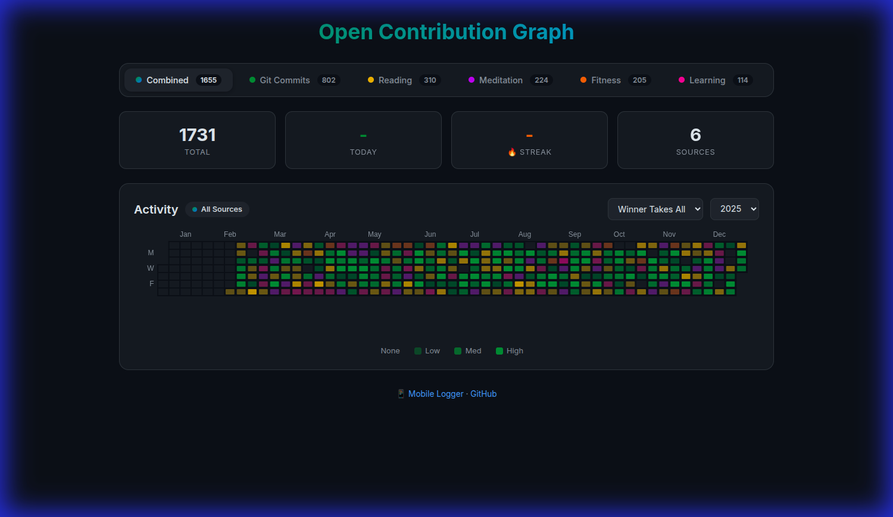
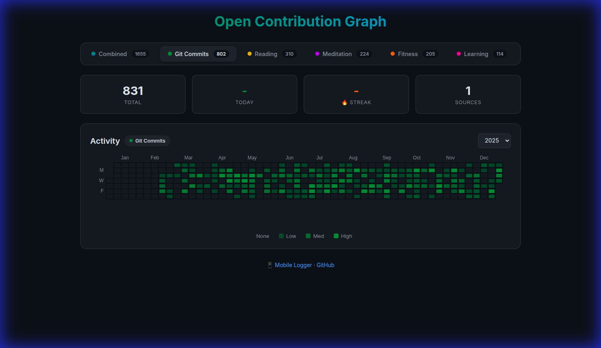
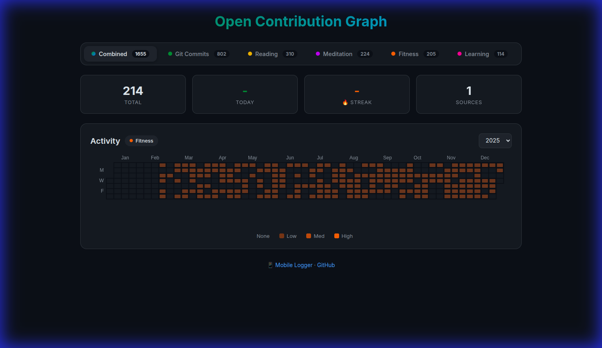

# Open Contribution Graph

**A self-hosted, privacy-first server to visualize your life as a contribution heatmap.**



*Track coding, fitness, reading, meditation, and more — all in one beautiful dashboard.*

## ⚡ What is this?
GitHub tracks your code, but what about the rest of your work?

**Open Contribution Graph** is a standalone, open-source server that aggregates "events" from any source—Git commits, Jira tickets, fitness activities, books read—and renders them on a unified, GitHub-style heatmap.

It is **not** a time tracker. It is an **Event Tracker**. It answers the question: *"Did I show up today?"*

* **Universal:** If you can send a POST request, you can track it.
* **Private:** Self-hosted single binary (Go + SQLite). Your data stays on your machine.
* **Fast:** Compiles to a ~10MB executable. Zero runtime dependencies.

## ✨ Features

### Per-Source Contribution Graphs
Switch between different event types to analyze your habits individually:

| Git Commits | Fitness |
|:-----------:|:-------:|
|  |  |

### Combine Modes
When viewing all sources together, choose how colors are blended:
- **Winner Takes All** — The dominant source for each day determines the color
- **Blend Colors** — Mix colors proportionally based on contribution ratios
- **Stack** — Use intensity based on total contributions

### Dynamic Statistics
- Total contributions (overall or per-source)
- Today's activity count
- Current streak tracking
- Active source count

## 🏗 Architecture
The system uses a simple "Hub and Spoke" model. You run the server (Hub), and "Agents" (Spokes) push data to it.

1.  **Server:** A lightweight Go HTTP server that manages the SQLite database.
2.  **Agents:** Scripts running on your laptop, CI/CD, or phone that push JSON events.
3.  **Frontend:** A minimal dashboard using Apache ECharts to visualize the data.

## 🚀 Quick Start

### Option A: Docker (Recommended)
Up and running in 30 seconds.

```bash
# 1. Clone the repo
git clone https://github.com/Tomer-Barak/contribution-graph.git
cd contribution-graph

# 2. Start the server
docker-compose up -d

# 3. Visit http://localhost:8080
```

### Option B: From Source (Go)
Perfect for local hacking.

```bash
go mod tidy
go run cmd/server/server.go
```

## 🔌 Integrating Data
The API is intentionally boring. To log an event, just POST to `/api/contributions`.

**Example:**
```bash
curl -X POST http://localhost:8080/api/contributions \
  -d '[{
    "source": "fitness",
    "context": "morning-run",
    "timestamp": "2023-10-27T07:00:00Z",
    "metadata": { "distance": "5km" }
  }]'
```

### Included Agents (`/agents`)
We include several reference implementations to get you started:

* **`git-watch` (Go):** Scans local folders for commits and syncs them automatically.
* **`github-import` (Go):** Backfills your graph using your public GitHub history.
* **`mobile-clicker` (HTML/PWA):** A mobile-web app to manually log habits (Reading, Meditating, etc.) from your phone.

## 🎨 Source Color Scheme
Each source type has its own distinct color:

| Source | Color |
|--------|-------|
| Git / GitHub | 🟢 Green |
| Jira | 🔵 Blue |
| Fitness | 🟠 Orange |
| Reading | 🟡 Yellow |
| Meditation | 🟣 Purple |
| Learning | 💗 Pink |

## 🛠 Tech Stack
* **Backend:** Go (Golang)
* **Database:** SQLite (modernc.org/sqlite - CGO free)
* **Frontend:** HTML5 + Apache ECharts

## License
**GPLv3** © Tomer Barak.
This project is free software: you can redistribute it and/or modify it under the terms of the GNU General Public License as published by the Free Software Foundation.
